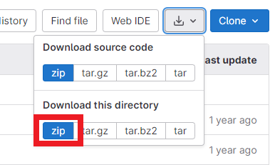
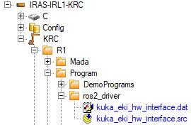
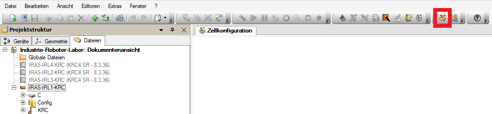

# START DEV CONTAINER / DOCKER
### Find Brause Docker:
```
. start_docker.sh
```
Alternatively: In VSCode click "reopen in conainer"

# GERGELYS STUFF
# R2E Tutorial

## First Time Setup - Robot

1. Boot up the robot
2. Boot up the Windows PC and log in with your RZ account
3. Download KRL sources
   from [this Link](https://www.w.hs-karlsruhe.de/gitlab/iras/research-projects/ki5grob/kuka-eki/-/tree/driver/krl) (
   with your RZ account)   
   
4. Unpack downloaded sources
5. Change IP in `src/kuka_eki/krl/EkiHwInterface.xml` and `src/kuka_eki/krl/EkiIOInterface.xml` to match the robot
   controller's IP <font size="1"> (should be found on the robot cell somewhere) </font>
6. Create new project on KUKA smartPAD (teach pendant) with KUKA smartHMI (touch screen user interface)
    - Open main menu <font size="1"> (key with small robot in the bottom right on smartPAD or top left in
      smartHMI) </font> &rarr; _Öffnen_
    - _Konfiguration_ &rarr; _Benutzergruppe_ &rarr; _Administrator_ (pass: kuka)
    - Open project management window <font size="1"> (blue WorkVisual icon (gear with robot in it) on smartHMI) </font>
        - "Ready2Educate" is the active project:
            - _Aktuellen Zustand sichern_
            - Name: "ros2_driver" &rarr; _OK_
            - select "ros2_driver" in _Verfügbare Projekte_ &rarr; _Entpinnen_
            - _Aktivieren_
        - "Ready2Educate" is not the active project:
            - Pin "Ready2Educate"
            - _Aktivieren_ &rarr; type in new project name, e.g. "ros2_driver" &rarr; confirm with _OK_
    - Confirm _Wollen Sie die Aktivierung des Projektes "ros2_driver" zulassen?_ with _Ja_
    - Confirm _Projektverwaltung_ panel _Wollen Sie fortfahren?_ with _Ja_
    - Wait until project is activated
7. Insert downloaded KRL sources in new project
    - On Windows PC open WorkVisual
    - Load newly created project "ros2_driver" from robot cell
        - _Datei_ &rarr; _Projekt öffnen_ &rarr; _Suchen_
        - Select cell with the corresponding IP
        - Select project "ros2_driver"
        - _Öffnen_
    - Navigate to "Dateien" tab in the left panel
    - Copy in step 5 modified `src/kuka_eki/krl/EkiHWInterface.xml` and `src/kuka_eki/krl/EkiIOInterface.xml`
      to `<KRC>/Config/User/Common/EthernetKRL`  
      
    - Create new folder `<KRC>/R1/Program/ros2_driver`
    - Copy extracted `src/krl/kuka_eki_hw_interface.dat` and `src/krl/kuka_eki_hw_interface.src`
      to `<KRC>/R1/Program/ros2_driver`  
      
8. Install program
    - Switch to user group _Administrator_ on smartPAD <font size="1"> (see step 6) </font>
    - Click _Installieren_ button  
      
    - _Weiter_ &rarr; _Weiter_ &rarr; _Weiter_ &rarr; _Ja_ on smartPAD &rarr;
      _Ja_ on smartPAD &rarr; _Fertigstellen_

## Start Hardware Interface on Robot

1. Switch to user group _Administrator_ on smartHMI
2. Activate project "ros2_driver" on smartHMI (if not already active)
    - Open project management window <font size="1"> (blue WorkVisual icon (gear with robot in it) on smartHMI) </font>
    - Select "ros2_driver" in _Verfügbare Projekte_ &rarr; _Entpinnen_
    - _Aktivieren_ &rarr; -> _Ja_
    - Wait until project is activated
3. On smartHMI navigate to  `R1/Program/ros2_driver`
4. Select `kuka_eki_hw_interface.src` &rarr; _Anwählen_
5. Select operating mode, e.g. Aut
    - Turn the switch on the smartPAD clockwise <font size="1"> (keyswitch left to emergency stop button) </font>
    - Select the operating mode on the smartHMI
    - Turn the switch back to the original position
6. Start program
    - Potentially change the robot's velocity <font size="1"> (start symbol on top of hand symbol in the status bar at
      the
      top of the smartHMI) </font> with the slider in the smartHMI or the +/- keys on the smartPAD
      <font size="1"> (penultimate buttons on the right side) </font>
    - Press start key (green play button) on the left side of the smartPAD multiple times, until the robot interpreter
      status indicator turns green
      <font size="1"> (the area around the "R" in the status bar at the top of the smartHMI) </font>
        - You potentially need to "Quitt" the robot by pressing the "Quitt" button on the robot cell
        - You need to activate the robot's drives if they are not active (grey "O" next to the "R" in the status bar at
          the top of the smartHMI)
            - click on the "O" in the status bar
            - click in "I" in the menu that pops up
    - If T1 or T2 operating mode is selected instead of Aut, one of the enabling switches on the rear of the smartPAD
      has
      to be held in center position and the start key has to be held constantly to continue running
      the program

## Setup ROS2 environment

1. Clone and build repository "R2E Tutorial"
    - Open a terminal (Ctrl + Alt + T) and navigate to projects folder
      ```
      mkdir -p ~/projects && cd ~/projects
      ```
    - Clone repo (if not already cloned); log in with your RZ account
      ```
      git clone -b dev https://www.w.hs-karlsruhe.de/gitlab/iras/common/instructions/iras_robots/r2e_tutorial.git
      ```
    - Navigate to cloned repo
      ``` 
      cd r2e_tutorial
      ```
    - Build container
      ```
      ./start_docker.sh
      ```
      If everything went well, you should be in the container like this: `robot@IRAS-IRL0-LIN:~/ros_ws$`
    - In the container, build workspace:
      ```
      colcon build
      ```
    - Source workspace
      ```
      source install/setup.bash
      ```
2. Start robot driver
    - If not already in container, attach to running container
      ```
      docker exec -it r2e_cell /bin/bash
      ```
    - Source workspace
      ```
      source install/setup.bash
      ```
    - Launch robot driver with MoveIt2 wrapper
      ```
      ros2 launch kuka_kr3_cell_description cell.launch.py
      ```
      This will open up a simulated hardware with visualisation.  
      To launch the real robot:
        - Make sure that you are in our local network (Wi-Fi or LAN)
        - Test your application in simulation first
        - Make sure that the robot is not in a collision state when the application is executed on the real robot
        - If everything is fine, execute
          ```
          ros2 launch kuka_kr3_cell_description cell.launch.py use_fake_hardware:=false robot_ip:=<robot-ip>

          ros2 launch kuka_kr3_cell_description cell.launch.py use_fake_hardware:=false robot_ip:=10.181.116.71

          ```
3. Check out tutorial code
    - Open up VSCode (Windows key &rarr; type "code" &rarr; Enter)
    - Open folder "r2e_tutorial" in VSCode
    - Open file `src/r2e_demos/r2e_demos/test_ros_env.py`
    - Read and understand the code
    - You might notice the `is_simulation` flag while creating the RobotClient object. Currently, this only controls whether
      the real gripper is connected or not. Whether the movement of the robot is simulated or not, solely depends on 
      the `use_fake_hardware` parameter at launch. If you want to test your application on the real robot, and also want to move the 
      gripper, you need to set the `is_simulation` flag to false.
4. Move robot
    - Open up a new terminal and attach to running container
      ```
      docker exec -it r2e_cell /bin/bash
      ```
    - Source workspace
      ```
      source install/setup.bash
      ```
    - Run sample application
      - before running the application, check the robot's movement in the simulated environment and make sure, that the
        robot is not in a collision state when the application is executed on the real robot 
      ```
      ros2 run r2e_demos test_ros_env
      ```

## Make your own ROS2 application

Note, that this repository is a template repository. You can use it as a starting point for your own ROS2 applications
but please do not push your changes to this repository.

## Specific Ahoi Brause Stuff
Base  coordinates R3 on metal grid set for easier orientation
Coordinates:
0.125 0.324 1.023
   
